# 4-class 한국어 SER 리더보드

**19개 구성, 하나의 split, 하나의 지표.** 음향 단독 5(백본 2종 × {동결, 풀
파인튜닝} + emotion2vec 원본 zero-shot), 텍스트 단독 1, 결합 13(late 5 · early 4 ·
cross-attention 4). 모든 run 이 동일한 화자+대본 분리 split(`*_di`, seed 42) 위에서
같은 엔진으로 학습·평가됐고, 그래서 행끼리 비교가 성립합니다.

test macro-F1 내림차순. `mF1`/`macroP`/`macroR` 은 macro 평균이고 나머지 열은
클래스별 F1 입니다. 원본 레코드: [`registry.jsonl`](registry.jsonl).

표 아래에는 run 별 confusion matrix · top-k 정확도 · calibration · 주요 오분류쌍이
붙어 있습니다.

먼저 [데이터 준비](../README.md#데이터-준비) 절차로 split 을 만듭니다.
지문이 일치하면 여기 수치와 비교 가능합니다.

| # | 구성 | mF1 | acc | macroP | macroR | happy | sad | angry | neutral |
|---|---|---|---|---|---|---|---|---|---|
| 1 | early · 음향[wav2vec2 full-FT] + RoBERTa | 0.8880 | 0.8947 | 0.9011 | 0.8792 | 0.946 | 0.928 | 0.831 | 0.848 |
| 2 | cross-attn · 음향[wav2vec2 full-FT] + RoBERTa | 0.8858 | 0.8927 | 0.8957 | 0.8788 | 0.945 | 0.927 | 0.824 | 0.847 |
| 3 | late · 음향[wav2vec2 full-FT] + RoBERTa | 0.8763 | 0.8821 | 0.8796 | 0.8810 | 0.916 | 0.914 | 0.841 | 0.834 |
| 4 | 음향단독 · wav2vec2 full-FT | 0.8588 | 0.8658 | 0.8652 | 0.8641 | 0.892 | 0.907 | 0.816 | 0.820 |
| 5 | cross-attn · 음향[emotion2vec full-FT] + RoBERTa | 0.8185 | 0.8344 | 0.8424 | 0.8068 | 0.918 | 0.888 | 0.755 | 0.714 |
| 6 | early · 음향[emotion2vec full-FT] + RoBERTa | 0.8160 | 0.8331 | 0.8418 | 0.8040 | 0.915 | 0.894 | 0.752 | 0.703 |
| 7 | late · 음향[emotion2vec full-FT] + RoBERTa | 0.8147 | 0.8303 | 0.8428 | 0.8021 | 0.923 | 0.877 | 0.730 | 0.729 |
| 8 | 음향단독 · emotion2vec full-FT | 0.7981 | 0.8152 | 0.8299 | 0.7849 | 0.922 | 0.863 | 0.701 | 0.706 |
| 9 | early · 음향[emotion2vec 원본] + RoBERTa | 0.7417 | 0.7589 | 0.7458 | 0.7412 | 0.781 | 0.838 | 0.710 | 0.637 |
| 10 | late · 음향[emotion2vec head-only] + RoBERTa | 0.7256 | 0.7413 | 0.7287 | 0.7248 | 0.778 | 0.821 | 0.695 | 0.608 |
| 11 | late · 음향[wav2vec2 head-only] + RoBERTa | 0.7095 | 0.7352 | 0.7310 | 0.7029 | 0.810 | 0.821 | 0.670 | 0.537 |
| 12 | cross-attn · 음향[emotion2vec 원본] + RoBERTa | 0.6986 | 0.7205 | 0.7060 | 0.6946 | 0.776 | 0.802 | 0.662 | 0.555 |
| 13 | 음향단독 · emotion2vec head-only | 0.6538 | 0.6801 | 0.6629 | 0.6544 | 0.652 | 0.836 | 0.592 | 0.535 |
| 14 | late · 음향[emotion2vec 원본] + RoBERTa | 0.6388 | 0.6508 | 0.6378 | 0.6452 | 0.708 | 0.701 | 0.631 | 0.515 |
| 15 | early · 음향[wav2vec2 원본] + RoBERTa | 0.6129 | 0.6210 | 0.6160 | 0.6183 | 0.678 | 0.675 | 0.593 | 0.506 |
| 16 | 음향단독 · wav2vec2 head-only | 0.5999 | 0.6589 | 0.6872 | 0.5999 | 0.787 | 0.806 | 0.537 | 0.269 |
| 17 | 텍스트단독 · roberta-large | 0.5961 | 0.6047 | 0.5975 | 0.6036 | 0.642 | 0.645 | 0.611 | 0.486 |
| 18 | 음향단독 · emotion2vec 원본 zero-shot | 0.5877 | 0.6255 | 0.6190 | 0.5981 | 0.611 | 0.797 | 0.429 | 0.513 |
| 19 | cross-attn · 음향[wav2vec2 원본] + RoBERTa | 0.5704 | 0.5806 | 0.5701 | 0.5734 | 0.575 | 0.642 | 0.567 | 0.498 |

## early/w2v_full  (test mF1=0.8880)


```
n=2451  acc(top1)=0.8947
top-k 정확도: top1=0.8947  top2=0.9841  top3=0.9959  top4=1.0000
확신도(calibration): {'mean_top1_correct': 0.9319550695368249, 'mean_top1_wrong': 0.8087404471552183, 'mean_margin_correct': 0.8929610974929824, 'mean_margin_wrong': 0.6639732775816086}
주요 오분류쌍: angry→sad=93, neutral→angry=74, happy→neutral=19, happy→angry=17, sad→angry=16, angry→happy=10, neutral→happy=9, happy→sad=6
confusion (행=정답, 열=예측) happy sad angry neutral:
[[544   6  17  19]
 [  1 806  16   4]
 [ 10  93 523   3]
 [  9   6  74 320]]
```

## cross/w2v_full  (test mF1=0.8858)
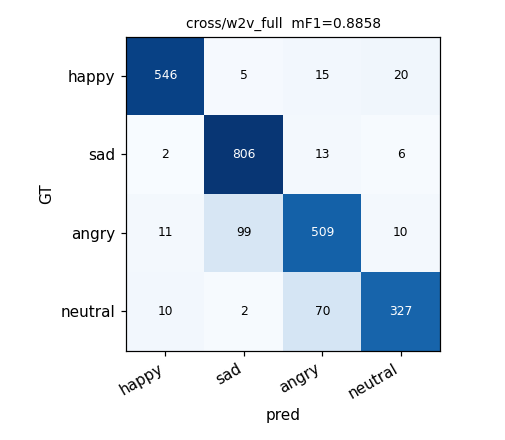

```
n=2451  acc(top1)=0.8927
top-k 정확도: top1=0.8927  top2=0.9829  top3=0.9988  top4=1.0000
확신도(calibration): {'mean_top1_correct': 0.9295211775029919, 'mean_top1_wrong': 0.7868478363897193, 'mean_margin_correct': 0.8871180528171345, 'mean_margin_wrong': 0.6278416730627691}
주요 오분류쌍: angry→sad=99, neutral→angry=70, happy→neutral=20, happy→angry=15, sad→angry=13, angry→happy=11, angry→neutral=10, neutral→happy=10
confusion (행=정답, 열=예측) happy sad angry neutral:
[[546   5  15  20]
 [  2 806  13   6]
 [ 11  99 509  10]
 [ 10   2  70 327]]
```

## late/w2v_full  (test mF1=0.8763)
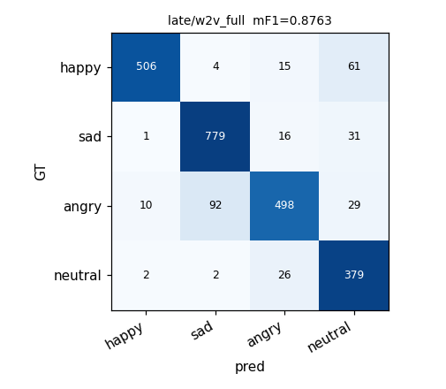

```
n=2451  acc(top1)=0.8821
top-k 정확도: top1=0.8821  top2=0.9645  top3=0.9931  top4=1.0000
확신도(calibration): {'mean_top1_correct': 0.3949852815257802, 'mean_top1_wrong': 0.3399102685467589, 'mean_margin_correct': 0.1731081531906155, 'mean_margin_wrong': 0.08101909835657402}
주요 오분류쌍: angry→sad=92, happy→neutral=61, sad→neutral=31, angry→neutral=29, neutral→angry=26, sad→angry=16, happy→angry=15, angry→happy=10
confusion (행=정답, 열=예측) happy sad angry neutral:
[[506   4  15  61]
 [  1 779  16  31]
 [ 10  92 498  29]
 [  2   2  26 379]]
```

## acoustic/w2v_full  (test mF1=0.8588)


```
n=2451  acc(top1)=0.8658
top-k 정확도: top1=0.8658  top2=0.9804  top3=0.9947  top4=1.0000
확신도(calibration): {'mean_top1_correct': 0.9666007507193913, 'mean_top1_wrong': 0.8750156933786772, 'mean_margin_correct': 0.9437472963720046, 'mean_margin_wrong': 0.7744316309298149}
주요 오분류쌍: angry→sad=112, happy→neutral=77, sad→neutral=31, neutral→angry=29, angry→neutral=28, happy→angry=17, angry→happy=16, sad→angry=11
confusion (행=정답, 열=예측) happy sad angry neutral:
[[487   5  17  77]
 [  2 783  11  31]
 [ 16 112 473  28]
 [  1   0  29 379]]
```

## cross/em_full  (test mF1=0.8185)
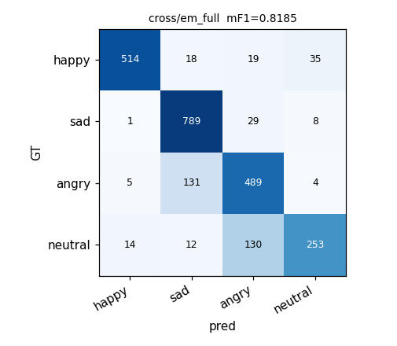

```
n=2451  acc(top1)=0.8344
top-k 정확도: top1=0.8344  top2=0.9584  top3=0.9861  top4=1.0000
확신도(calibration): {'mean_top1_correct': 0.9521931209093072, 'mean_top1_wrong': 0.879512286427146, 'mean_margin_correct': 0.9260602361710887, 'mean_margin_wrong': 0.7919647407335986}
주요 오분류쌍: angry→sad=131, neutral→angry=130, happy→neutral=35, sad→angry=29, happy→angry=19, happy→sad=18, neutral→happy=14, neutral→sad=12
confusion (행=정답, 열=예측) happy sad angry neutral:
[[514  18  19  35]
 [  1 789  29   8]
 [  5 131 489   4]
 [ 14  12 130 253]]
```

## early/em_full  (test mF1=0.8160)
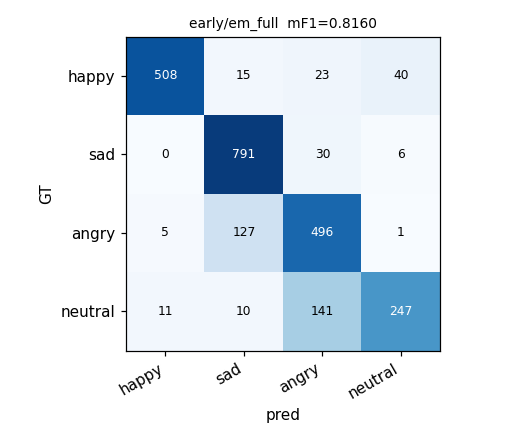

```
n=2451  acc(top1)=0.8331
top-k 정확도: top1=0.8331  top2=0.9437  top3=0.9718  top4=1.0000
확신도(calibration): {'mean_top1_correct': 0.9521165119622338, 'mean_top1_wrong': 0.8935083513890099, 'mean_margin_correct': 0.9298209499705797, 'mean_margin_wrong': 0.8225264570047599}
주요 오분류쌍: neutral→angry=141, angry→sad=127, happy→neutral=40, sad→angry=30, happy→angry=23, happy→sad=15, neutral→happy=11, neutral→sad=10
confusion (행=정답, 열=예측) happy sad angry neutral:
[[508  15  23  40]
 [  0 791  30   6]
 [  5 127 496   1]
 [ 11  10 141 247]]
```

## late/em_full  (test mF1=0.8147)


```
n=2451  acc(top1)=0.8303
top-k 정확도: top1=0.8303  top2=0.9388  top3=0.9820  top4=1.0000
확신도(calibration): {'mean_top1_correct': 0.39427406004700705, 'mean_top1_wrong': 0.3385120417829519, 'mean_margin_correct': 0.17252139408064776, 'mean_margin_wrong': 0.07968420375718913}
주요 오분류쌍: angry→sad=174, neutral→angry=111, happy→neutral=29, neutral→sad=22, neutral→happy=19, happy→sad=15, happy→angry=13, sad→angry=11
confusion (행=정답, 열=예측) happy sad angry neutral:
[[529  15  13  29]
 [  2 810  11   4]
 [ 10 174 439   6]
 [ 19  22 111 257]]
```

## acoustic/em_full  (test mF1=0.7981)
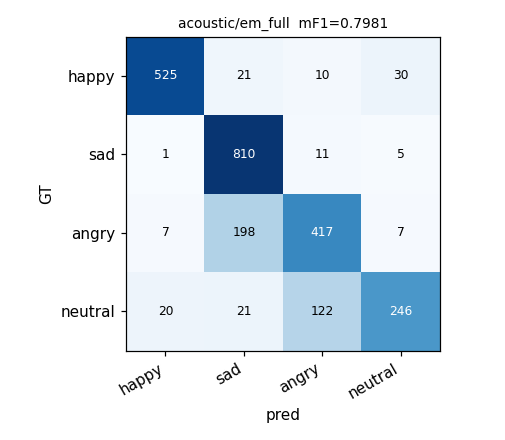

```
n=2451  acc(top1)=0.8152
top-k 정확도: top1=0.8152  top2=0.9429  top3=0.9902  top4=1.0000
확신도(calibration): {'mean_top1_correct': 0.9537761978296683, 'mean_top1_wrong': 0.9087588418530412, 'mean_margin_correct': 0.9291797795582826, 'mean_margin_wrong': 0.8443389741757852}
주요 오분류쌍: angry→sad=198, neutral→angry=122, happy→neutral=30, happy→sad=21, neutral→sad=21, neutral→happy=20, sad→angry=11, happy→angry=10
confusion (행=정답, 열=예측) happy sad angry neutral:
[[525  21  10  30]
 [  1 810  11   5]
 [  7 198 417   7]
 [ 20  21 122 246]]
```

## early/em_pre  (test mF1=0.7417)


```
n=2451  acc(top1)=0.7589
top-k 정확도: top1=0.7589  top2=0.9306  top3=0.9820  top4=1.0000
확신도(calibration): {'mean_top1_correct': 0.7885224469755094, 'mean_top1_wrong': 0.6129980614681274, 'mean_margin_correct': 0.651838365970064, 'mean_margin_wrong': 0.35952030899177423}
주요 오분류쌍: angry→sad=141, happy→neutral=90, neutral→angry=55, sad→neutral=54, neutral→happy=54, happy→angry=47, sad→angry=39, angry→happy=33
confusion (행=정답, 열=예측) happy sad angry neutral:
[[436  13  47  90]
 [  7 727  39  54]
 [ 33 141 424  31]
 [ 54  27  55 273]]
```

## late/em_head  (test mF1=0.7256)


```
n=2451  acc(top1)=0.7413
top-k 정확도: top1=0.7413  top2=0.9176  top3=0.9788  top4=1.0000
확신도(calibration): {'mean_top1_correct': 0.36163023843210623, 'mean_top1_wrong': 0.3134868974802389, 'mean_margin_correct': 0.12695310648900315, 'mean_margin_wrong': 0.05269187436728688}
주요 오분류쌍: angry→sad=101, happy→neutral=80, sad→angry=80, neutral→angry=70, happy→angry=68, sad→neutral=51, angry→neutral=48, neutral→happy=42
confusion (행=정답, 열=예측) happy sad angry neutral:
[[428  10  68  80]
 [ 15 681  80  51]
 [ 29 101 451  48]
 [ 42  40  70 257]]
```

## late/w2v_head  (test mF1=0.7095)
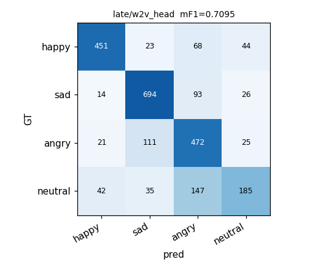

```
n=2451  acc(top1)=0.7352
top-k 정확도: top1=0.7352  top2=0.8960  top3=0.9784  top4=1.0000
확신도(calibration): {'mean_top1_correct': 0.36943432733416165, 'mean_top1_wrong': 0.3160851577010739, 'mean_margin_correct': 0.13747782710636836, 'mean_margin_wrong': 0.05699692835978743}
주요 오분류쌍: neutral→angry=147, angry→sad=111, sad→angry=93, happy→angry=68, happy→neutral=44, neutral→happy=42, neutral→sad=35, sad→neutral=26
confusion (행=정답, 열=예측) happy sad angry neutral:
[[451  23  68  44]
 [ 14 694  93  26]
 [ 21 111 472  25]
 [ 42  35 147 185]]
```

## cross/em_pre  (test mF1=0.6986)
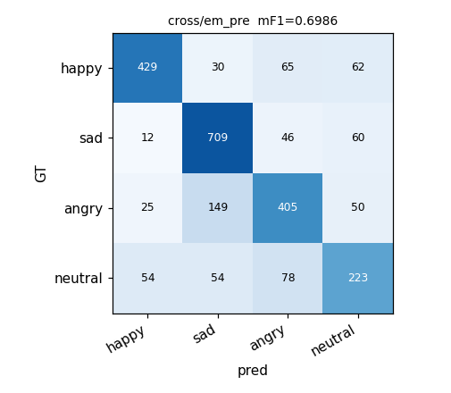

```
n=2451  acc(top1)=0.7205
top-k 정확도: top1=0.7205  top2=0.8923  top3=0.9665  top4=1.0000
확신도(calibration): {'mean_top1_correct': 0.8879486793272297, 'mean_top1_wrong': 0.7688599811380344, 'mean_margin_correct': 0.8092379996005769, 'mean_margin_wrong': 0.6049692584427049}
주요 오분류쌍: angry→sad=149, neutral→angry=78, happy→angry=65, happy→neutral=62, sad→neutral=60, neutral→sad=54, neutral→happy=54, angry→neutral=50
confusion (행=정답, 열=예측) happy sad angry neutral:
[[429  30  65  62]
 [ 12 709  46  60]
 [ 25 149 405  50]
 [ 54  54  78 223]]
```

## acoustic/em_head  (test mF1=0.6538)
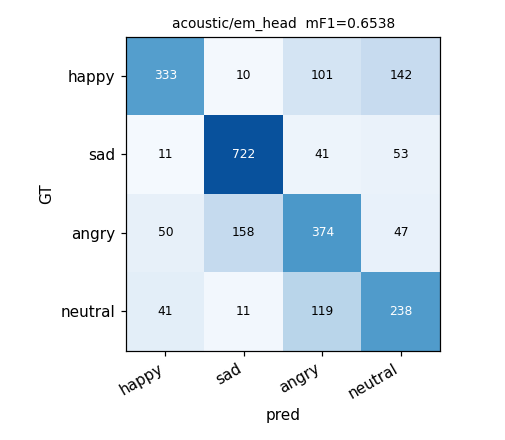

```
n=2451  acc(top1)=0.6801
top-k 정확도: top1=0.6801  top2=0.8935  top3=0.9714  top4=1.0000
확신도(calibration): {'mean_top1_correct': 0.7160037054295912, 'mean_top1_wrong': 0.5918546281377832, 'mean_margin_correct': 0.5402770560570144, 'mean_margin_wrong': 0.33777420981904843}
주요 오분류쌍: angry→sad=158, happy→neutral=143, neutral→angry=119, happy→angry=100, sad→neutral=53, angry→happy=50, angry→neutral=47, sad→angry=41
confusion (행=정답, 열=예측) happy sad angry neutral:
[[333  10 101 142]
 [ 11 722  41  53]
 [ 50 158 374  47]
 [ 41  11 119 238]]
```

## late/em_pre  (test mF1=0.6388)
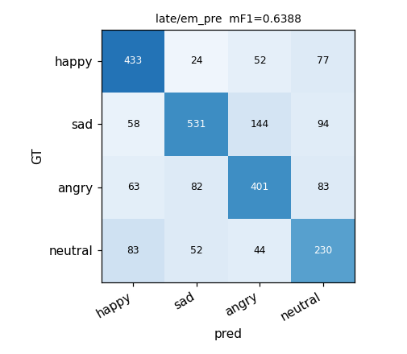

```
n=2451  acc(top1)=0.6508
top-k 정확도: top1=0.6508  top2=0.8784  top3=0.9559  top4=1.0000
확신도(calibration): {'mean_top1_correct': 0.33430166001013406, 'mean_top1_wrong': 0.3040814718372792, 'mean_margin_correct': 0.10268137586762982, 'mean_margin_wrong': 0.05402264382918354}
주요 오분류쌍: sad→angry=144, sad→neutral=94, angry→neutral=83, neutral→happy=83, angry→sad=82, happy→neutral=77, angry→happy=63, sad→happy=58
confusion (행=정답, 열=예측) happy sad angry neutral:
[[433  24  52  77]
 [ 58 531 144  94]
 [ 63  82 401  83]
 [ 83  52  44 230]]
```

## early/w2v_pre  (test mF1=0.6129)
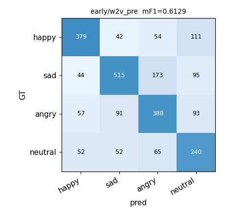

```
n=2451  acc(top1)=0.6210
top-k 정확도: top1=0.6210  top2=0.8319  top3=0.9319  top4=1.0000
확신도(calibration): {'mean_top1_correct': 0.7581251243444499, 'mean_top1_wrong': 0.6287873670955713, 'mean_margin_correct': 0.6248418252464719, 'mean_margin_wrong': 0.41897640881033893}
주요 오분류쌍: sad→angry=173, happy→neutral=111, sad→neutral=95, angry→neutral=93, angry→sad=91, neutral→angry=65, angry→happy=57, happy→angry=54
confusion (행=정답, 열=예측) happy sad angry neutral:
[[379  42  54 111]
 [ 44 515 173  95]
 [ 57  91 388  93]
 [ 52  52  65 240]]
```

## acoustic/w2v_head  (test mF1=0.5999)
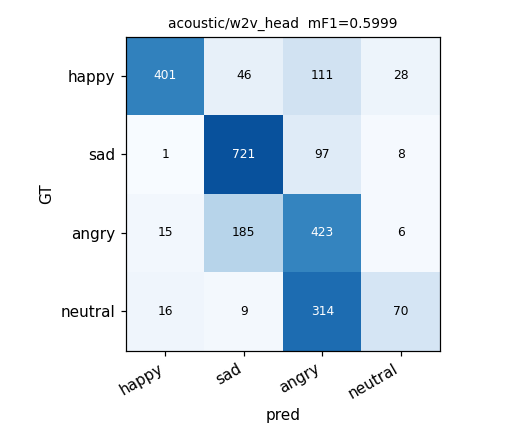

```
n=2451  acc(top1)=0.6589
top-k 정확도: top1=0.6589  top2=0.8964  top3=0.9718  top4=1.0000
확신도(calibration): {'mean_top1_correct': 0.7701907826069179, 'mean_top1_wrong': 0.6131723420477355, 'mean_margin_correct': 0.6142985607487351, 'mean_margin_wrong': 0.3685257409449894}
주요 오분류쌍: neutral→angry=314, angry→sad=185, happy→angry=111, sad→angry=97, happy→sad=46, happy→neutral=28, neutral→happy=16, angry→happy=15
confusion (행=정답, 열=예측) happy sad angry neutral:
[[401  46 111  28]
 [  1 721  97   8]
 [ 15 185 423   6]
 [ 16   9 314  70]]
```

## text/roberta  (test mF1=0.5961)
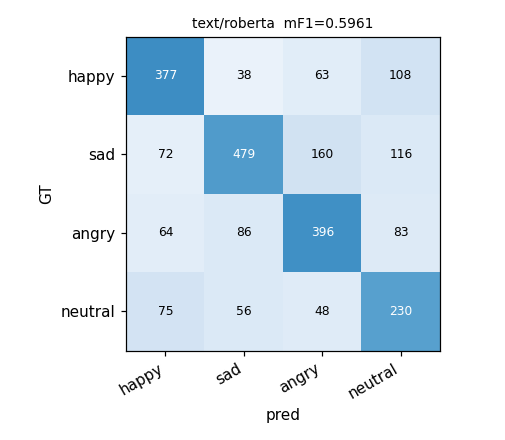

```
n=2451  acc(top1)=0.6047
top-k 정확도: top1=0.6047  top2=0.8237  top3=0.9359  top4=1.0000
확신도(calibration): {'mean_top1_correct': 0.7853309649027215, 'mean_top1_wrong': 0.6475547983943283, 'mean_margin_correct': 0.6687904719817833, 'mean_margin_wrong': 0.44761059476876175}
주요 오분류쌍: sad→angry=160, sad→neutral=116, happy→neutral=108, angry→sad=86, angry→neutral=83, neutral→happy=75, sad→happy=72, angry→happy=64
confusion (행=정답, 열=예측) happy sad angry neutral:
[[377  38  63 108]
 [ 72 479 160 116]
 [ 64  86 396  83]
 [ 75  56  48 230]]
```

## acoustic/em_pre  (test mF1=0.5877)
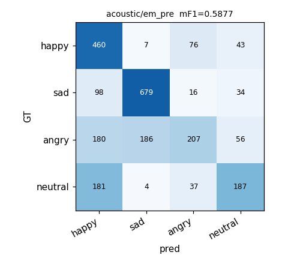

```
n=2451  acc(top1)=0.6255
top-k 정확도: top1=0.6255  top2=0.7927  top3=0.9164  top4=1.0000
확신도(calibration): {'mean_top1_correct': 0.42804688541660707, 'mean_top1_wrong': 0.37642294805166127, 'mean_margin_correct': 0.23618324235764693, 'mean_margin_wrong': 0.16491045870674506}
주요 오분류쌍: angry→sad=186, neutral→happy=181, angry→happy=180, sad→happy=98, happy→angry=76, angry→neutral=56, happy→neutral=43, neutral→angry=37
confusion (행=정답, 열=예측) happy sad angry neutral:
[[460   7  76  43]
 [ 98 679  16  34]
 [180 186 207  56]
 [181   4  37 187]]
```

## cross/w2v_pre  (test mF1=0.5704)
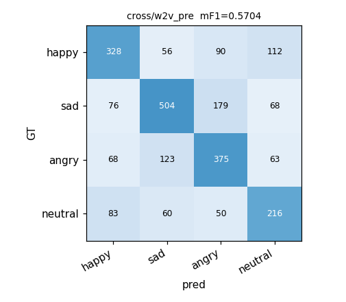

```
n=2451  acc(top1)=0.5806
top-k 정확도: top1=0.5806  top2=0.7727  top3=0.9053  top4=1.0000
확신도(calibration): {'mean_top1_correct': 0.9038301217528133, 'mean_top1_wrong': 0.8252027858339978, 'mean_margin_correct': 0.8369207282388652, 'mean_margin_wrong': 0.7009649347453107}
주요 오분류쌍: sad→angry=179, angry→sad=123, happy→neutral=112, happy→angry=90, neutral→happy=83, sad→happy=76, sad→neutral=68, angry→happy=68
confusion (행=정답, 열=예측) happy sad angry neutral:
[[328  56  90 112]
 [ 76 504 179  68]
 [ 68 123 375  63]
 [ 83  60  50 216]]
```